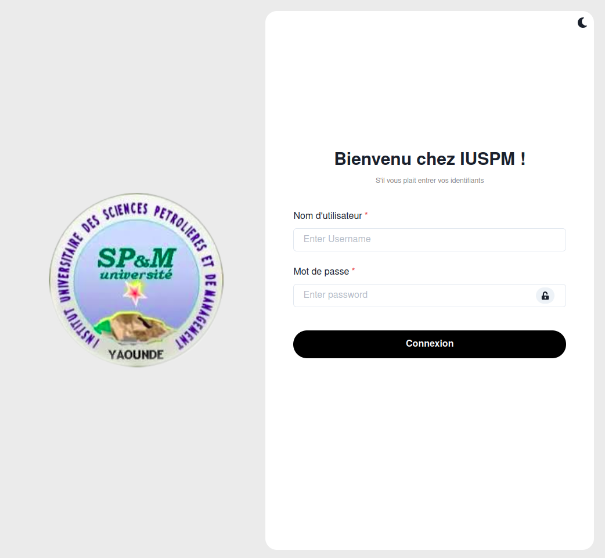
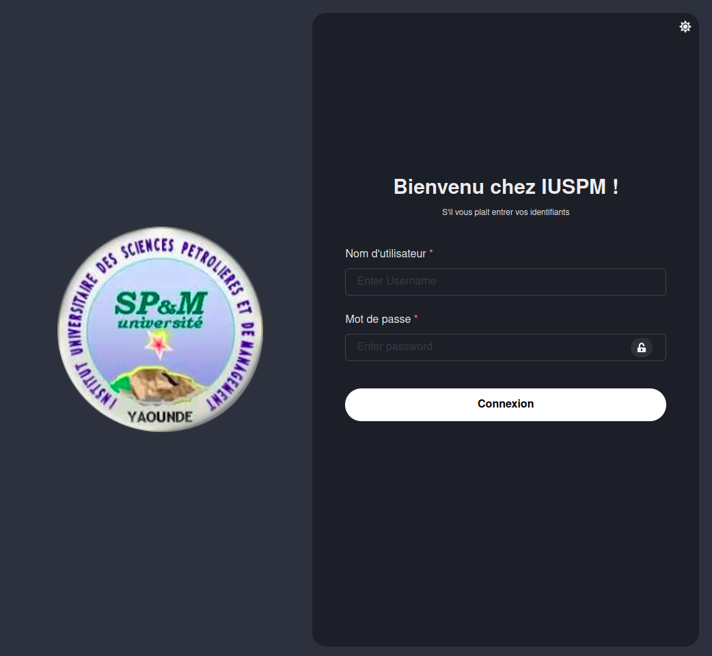
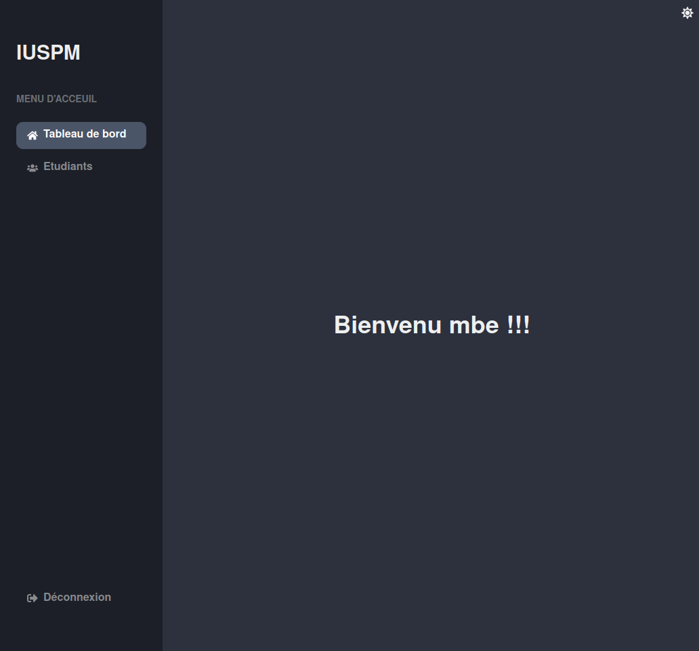
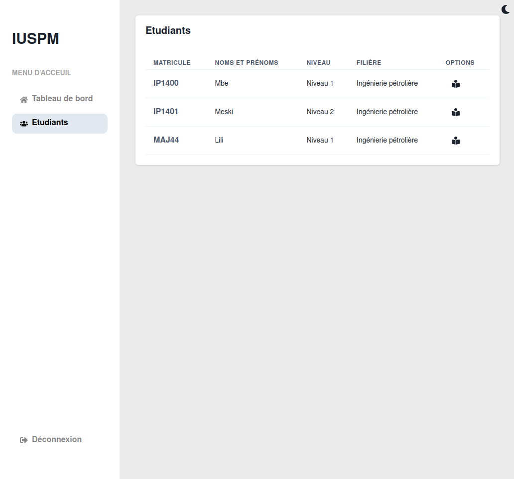
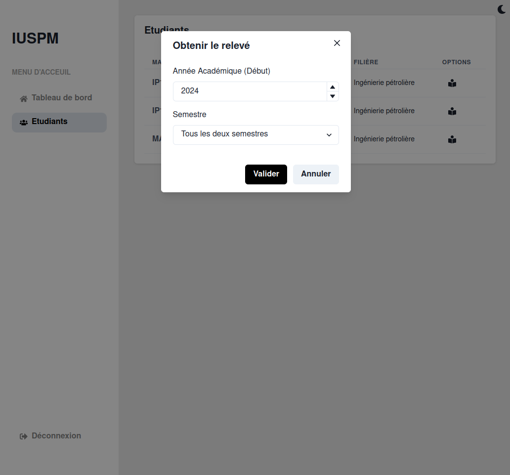
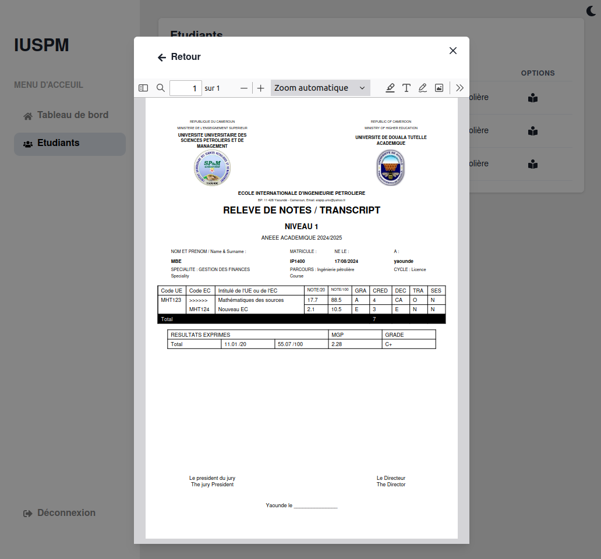
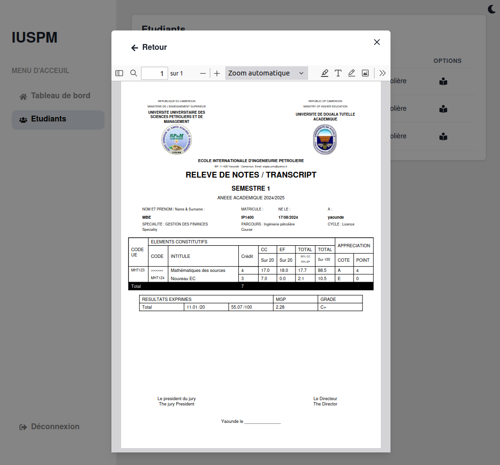
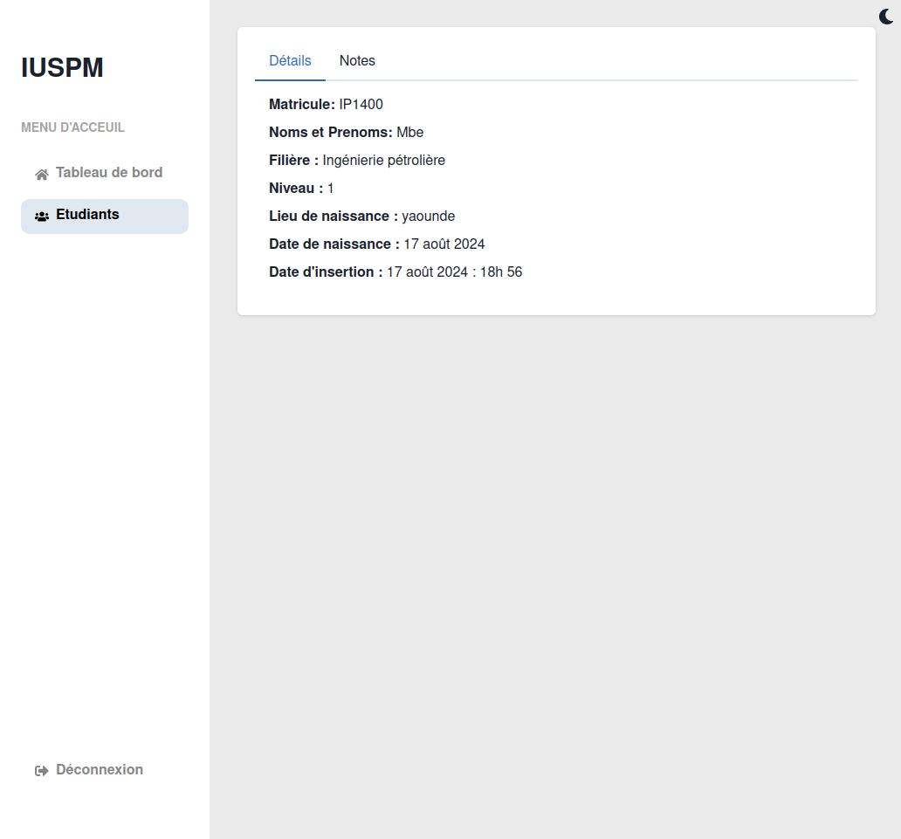
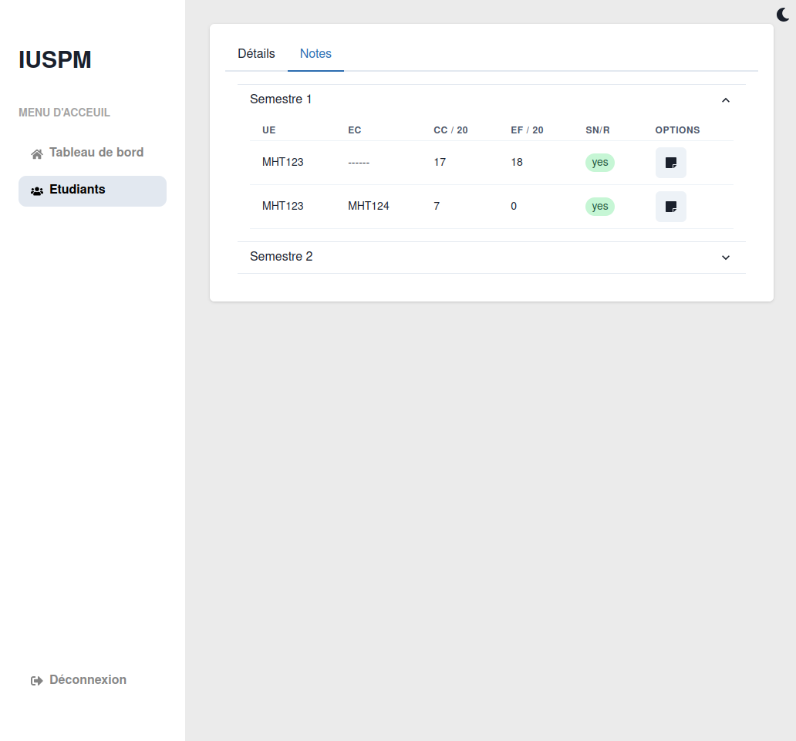
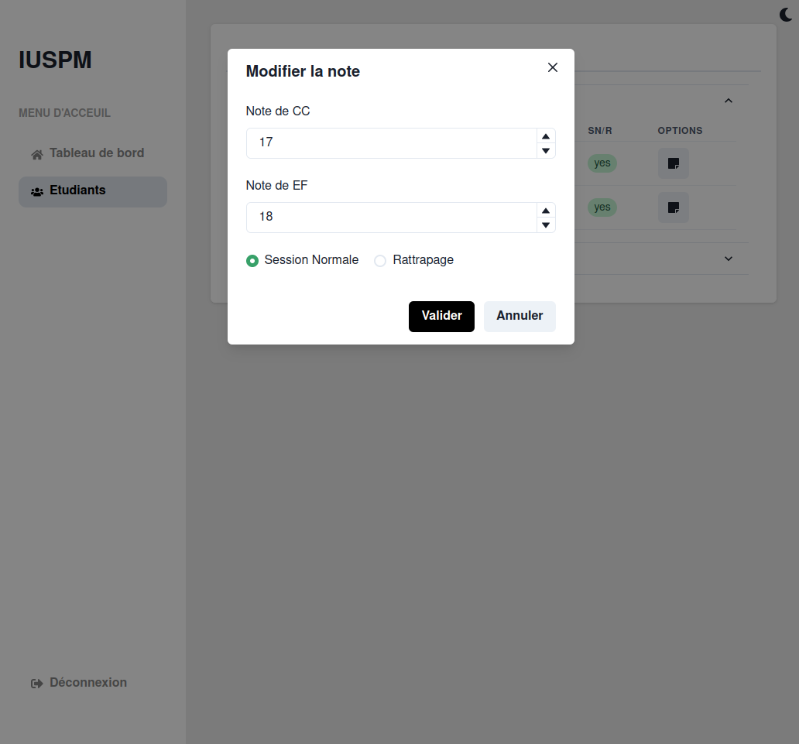

# iuspm

projet visant à gérer les relevés de notes, la programmation et la planification des cours de l'institut iuspm

## Installation et suppression manuelle

- Installer l'API de `iuspm` dans un hôte de votre choix comme le voudrait une application `Django`.
Prenez garde aux configurations (Lire le fichier `iuspm_api/README.md`)
- Installer le front de `iuspm` dans un hôte de votre choix comme le voudrait une application `React`.
Prenez garde aux configurations comme la spécification des informations de communication entre le front et le back.

Leur suppression se passe de la même manière que des applications `Django` et `React`.

## Vues principales

- Login:
    
    

- Dashboard:
    

- Liste des étudiants:
    

- Formulaire de génération du relevé :
    

- Relevé par niveau :
    

- Relevé de notes par semestre:
    

- Detail d'un étudiant
    

- Note d'un étudiant
    

- Formulaire de note
    
